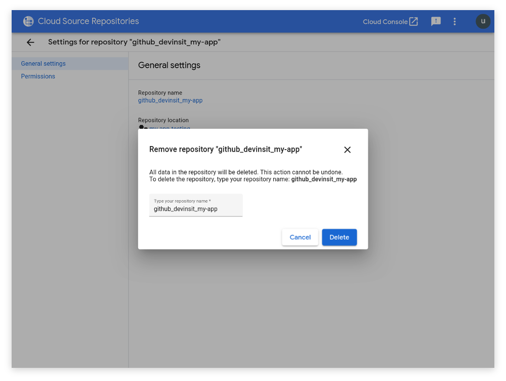

# Getting Started

This guide will show you how to create your first Kubails project, deploy the necessary infrastructure to GCP, and start developing your product.


This guide (and Kubails in general) assumes a **baseline competency** of all the tools and technologies outlined in the _Prerequisites_ below.

If you do not have these competencies (or are unwilling to learn them), then **Kubails is probably not the tool for you**.


## Prerequisites

> Since Kubails wraps together many individual tools, you'll need to have all of them installed.

You will need **Python 3** and `pip` to be able to install and operate the `kubails` CLI.

Additionally, you must have the following installed to be able to make use of Kubails:

* [git](https://git-scm.com/downloads)
* [terraform 0.11](https://releases.hashicorp.com/terraform/)
* [gcloud](https://cloud.google.com/sdk/install)
* kubectl (can be installed using `gcloud components install kubectl`)
* [docker](https://docs.docker.com/install/)
* [docker-compose](https://docs.docker.com/compose/install/)
* [helm](https://helm.sh/docs/intro/install/)

On top of having these installed, you'll also need **sufficient privileges** (i.e. admin) over your Git hosting provider of choice. This is for connecting the repo to GCP later.

Additionally, you must have the **Owner** role on your GCP project.

Finally, the last prerequisite to using Kubails is that you must own a **domain name** and have sufficient privileges to change its name servers. This is because we'll be using GCP Cloud DNS later for DNS resolution.


Kubails does not yet fully support Terraform 0.12. As such, you _must_ use **Terraform 0.11** for the time being.


## Install Kubails

If you have Python 3 and `pip` installed, then you can install `kubails` from the repo:

```
git clone https://github.com/DevinSit/kubails
cd kubails

pip install .
```


Kubails will be **directly installable** from `pip` sometime in the future.


## Create a Kubails Project

To create a new Kubails project, run the following:

```
kubails new
```

You'll then be prompted to enter information on how to configure your project. Here's an explanation of all the fields:

| Field | Description |
| :--- | :--- |
| `project_title` | The human-readable title of your project. |
| `project_name` | The machine-readable name of your project. Used for naming resources, so it can't contain spaces. |
| `description` | A description of your project for the `README`. |
| `domain` | The domain that will host your application. Yes, it is **mandatory**. |
| `domain_owner_email` | The email of whoever should receive emails if something goes wrong with the SSL certificate (LetsEncrypt). |
| `gcp_project` | The ID of the GCP project to host the Kubails infrastructure. |
| `gcp_region` | The region to use for certain pieces of the Kubails infrastructure. |
| `gcp_zone` | The zone to use for certain pieces of the Kubails infrastructure. Must be a zone in `gcp_region`. |
| `remote_repo_host` | Where your Git repo will be hosted. Your choice of either **GitHub** or **Bitbucket**. |
| `remote_repo_owner` | The (lowercased) owner of your hosted Git repo. For example, for Kubails, the owner is `devinsit` (from https://github.com/DevinSit/kubails). |


After you've entered this information, you'll then be prompted to create some **services**.

You'll be asked how many services you need and to choose which **templates** to use for each service. Finally, you'll be asked at what **subdomain** each service will be exposed and to give a name to each service.

For more information on services and templates, check out [Services](./topics/services/Services.md).


If you want a service to be exposed at the **root domain**, then leave the `subdomain` prompt empty.

Obviously, you can only have **one** service at the root domain 😄


Once you have the project created, don't forget to turn it into a **Git repo** and push it to your remote host of choice.

But now you have another choice: you can either [start developing locally](#start-developing-locally) right now, or you can [deploy the infrastructure](#deploy-the-kubails-infrastructure) to start taking advantage of the power of Kubails.

# Start Developing Locally

Since Kubails uses `docker-compose` for local development, getting things started is quite easy:



```
kubails service start
```



```
make start
```



These commands essentially map down to `docker-compose up`, but with some quality-of-life tweaks.

Once all the services have been started, you'll be able to access them locally over their **exposed ports**. Check your `services/docker-compose.yaml` file for the port mappings of your particular services.


One of the (many) opinionated decisions for Kubails was to use `make` as basically a **task runner**.

That's why there's a root `Makefile` with a task for starting the services.

For more information on the use of `make` in Kubails, see [Make as a Task Runner](./topics/MakeTaskRunner.md).


# Deploy the Kubails Infrastructure

This is where Kubails really makes its money (metaphorically speaking). At the end of deploying all of the infrastructure, you'll have (among other things) the following:

* A **Kubernetes cluster** for hosting your services.
* A **CI/CD pipeline** for deploying your services using a per branch system.
* **HTTPS** courtesy of the free SSL/TLS certificates offered by **LetsEncrypt**.

For a complete breakdown of all the infrastructure generated by Kubails, take a look at [Infrastructure](./topics/infrastructure/Infrastructure.md).

Let's get started!

## Create a GCP Project

If you haven't already done so, you'll need a GCP project that you can deploy the Kubails infrastructure to.

Google has a great [guide](https://cloud.google.com/resource-manager/docs/creating-managing-projects) on how to do this.

## Authenticate `gcloud` to GCP

Kubails assumes that you are already authenticated to GCP using `gcloud`.

To do so, just run the following:

```
gcloud auth login
```

Then follow the prompts and enter your account information.

### Setup a `gcloud` Configuration

> This is an optional step to make using `gcloud` easier.

If you frequently work with **multiple GCP accounts or projects**, then setting up separate **configurations** is a good practice to make switching between these easier.

To create a configuration:

```
gcloud config configurations [NAME]
```

Once you create the configuration, it'll automatically be activated. From here, you can set some **properties** like the default project or zone:

```
gcloud config set project [PROJECT_ID]

gcloud config set compute/region us-east1
gcloud config set compute/zone us-east1-d
```

## Enable the StackDriver Workspace

> This is one of the few non-automatable tasks.

Before deploying anything, we need to make sure the **StackDriver workspace** has been created.

This can be done simply by going to the [Monitoring](https://console.cloud.google.com/monitoring) section in the GCP console and waiting for GCP to configure workspace.



StackDriver is GCP's **all-in-one operations** service. It handles things like centralized logging, monitoring, and alerting.


## Setup the GCP Project


You must have the **Owner** role on your GCP project to do this step.


Before the infrastructure can be deployed, we need to get the GCP project all ready to receive the infrastructure:

```
kubails infra setup
```

This can take **5 to 10 minutes** to complete.


Among other things, this will:

* Enable all of the **GCP APIs** needed for Kubails.
* Deploy a **custom Docker image** for the Cloud Build pipeline steps.
* Setup a **service account** to manage the infrastructure.
* Create a **GCS bucket** for Terraform state.

## Deploy the Infrastructure

This is the part that **takes the longest**. However, thanks to Kubails, most of it is just waiting! Run this:

```
kubails infra deploy
```

This command starts off by deploying all of the **GCP infrastructure** using Terraform.


Then it waits and prompts you to do another one of the non-automatable tasks: **change your name servers**! Yes, Kubails makes use of GCP's Cloud DNS service for DNS resolution. As such, you'll need to change the name servers of your domain at your registrar to use those provided at the prompt.


Once you've confirmed that the name servers have been changed, the `deploy` command will go through its final phase: deploying all the **necessary manifests** to the Kubernetes cluster — things like `cert-manager` and `ingress-nginx`.


After the cluster has finished being configured, you will now have all of the infrastructure deployed! 🎉

However...

### The Curse of DNS

There's this one last little, itty-bitty thing to worry about... **DNS**.

As much as deploying all of the above infrastructure might take **10 to 20 minutes**, waiting for the change in name servers to propagate could take anywhere from a couple hours to 1 or 2 days.

And why is this important? Well, the domain needs to be resolvable using the Cloud DNS name servers so that the **SSL/TLS certificate** can be generated. And only once this has happened can you access any services deployed to the cluster.

In the meantime, you can check whether the certificate has been generated (and by proxy, whether the domain is resolvable):

```
kubectl -n cert-manager get certificates
```


If the `READY` state for the certificate is `True`, then you're good to go! Otherwise, you'll just need to wait.


If the certificate doesn't become ready within a day or two, then you'll need to **manually troubleshoot it**.

This is where your knowledge of DNS, Kubernetes, and `cert-manager` is gonna come handy!


## Enable the CI/CD Pipeline

> This is the last of the non-automatable tasks.

Although the infrastructure deployment step from earlier created the Cloud Build trigger that constitutes the CI/CD pipeline for Kubails, there's one manual step we have to take to enable it.

GCP has their own hosted Git solution called **Cloud Source Repositories**. All Cloud Build triggers are.. triggered by changes from a Cloud Source Repository.

However, one of the things this service enables is mirroring a repo from an external Git host like GitHub or Bitbucket. As such, here's what we'll need to do to get the Cloud Build pipeline working:

### 1. Go to the [Cloud Source Repositories service](https://source.cloud.google.com/).
### 2. Find the repository that corresponds with your project and go to its settings.
### 3. Delete the repository. Yes, delete it! This was just placeholder for the mirrored repo that you're about to create.



### 4. Add a new repository and choose `Connect external repository`.
### 5. From here, just follow the prompts to authenticate to your Git provider and choose the correct repo to mirror.
### 6. Once the repo has finished being mirrored, you're all done!

Because of the way we named the dummy repo, it should match the name of new mirrored repo and the Cloud Build trigger will **be automatically connected** to it.

From now on, any commits you push to your remote Git repo will trigger builds that will deploy your services to the cluster! 🎉

To learn more the CI/CD process and per branch deployments, check out [this page](./topics/PerBranchDeployments.md).

# What's Next?

Developing your project of course!

Although if you're looking for more things about Kubails...

* How about [enabling Slack notifications](./integrations/SlackNotifications.md) for build statuses?
* Perhaps you'd be interested in [getting build statuses forwarded to your Git provider](./integrations/GitBuildStatuses.md)?
* Or maybe you want to learn [how to further configure Kubails](./topics/ProjectConfiguration.md)?

Regardless, the docs are setup to help you get the most out of Kubails, so feel free explore.
