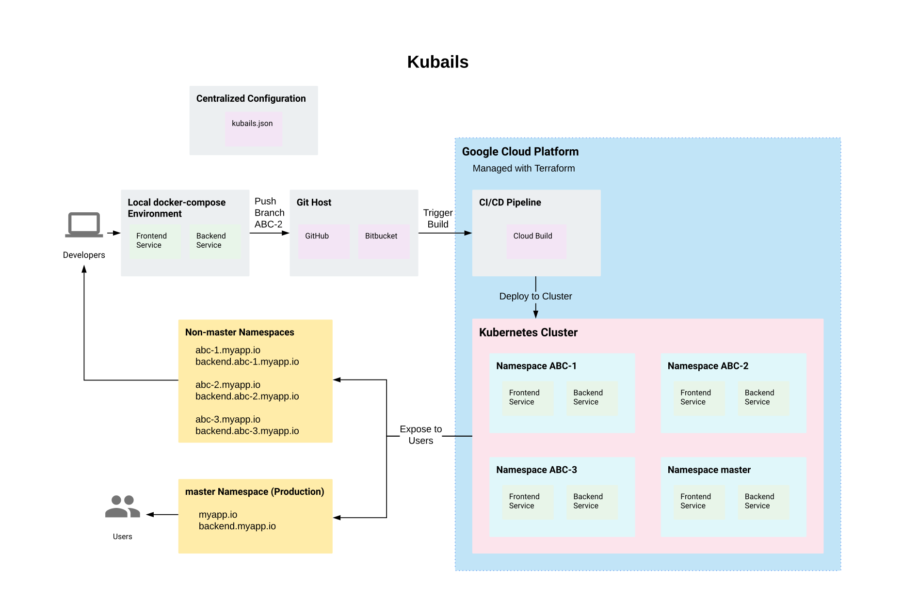

# Introduction

**Kubails** is a highly opinionated framework for enabling rapid deployment and prototyping of Docker-based web services.

That is, if you're developing a web app, **Kubails** makes a bunch of tooling and infrastructure decisions for you so that you can get your app deployed in **less than an hour**. Then you can start iterating quickly while being supported by modern development comforts like **repeatable environments**, **true CI/CD**, and **per branch deployments**.

So if this sounds like the sort of thing that would be helpful for your project, then try out Kubails and get to building _now_.

If you have any questions about the project, feel free to check the [FAQ](./FAQ.md).


Kubails is still **alpha** software.

While the underlying technologies are mostly production-ready, using Kubails for production projects is certainly at **your own risk**!


## Features

* **Fast initial setup**: Get deployed and developing in less than an hour.
* **Opinionated project architecture**: Worry less about deciding between one person's cloud or another.
* **Robust infrastructure management**: With Terraform and Helm, everything is just configuration as code.
* **Centralized configuration**: `kubails.json` is your entrypoint to keeping Terraform, Helm, and everything else in sync.
* **Scale as you grow**: By the power of _The Cloud™_ and Kubernetes, you can scale as much as you have money.
* **Modern developer experience**: Between Docker and per branch deployments, you can be sure that what works in one place works everywhere.

## Get Started

Follow the [Getting Started guide](./GettingStarted.md) to get your project up and running in the next hour.

## Guides

Once you've got a Kubails project going, here are some guides on how to accomplish certain tasks.

1. TODO

## Learn about Kubails

While Kubails makes a lot of decisions for you and tries to automate away a lot of the drudgery, that doesn't mean you shouldn't understand the underlying concepts and technologies.

The docs are structured to explain each piece of Kubails and what technologies are used to make it happen.

1. Folder Structure
2. Services
3. Infrastructure
4. Configuration
5. Manifests
6. TODO

## References

Need to quickly look up what a configuration does or how a command works? Look no further.

1. CLI Reference
2. kubails.json Reference
3. TODO
